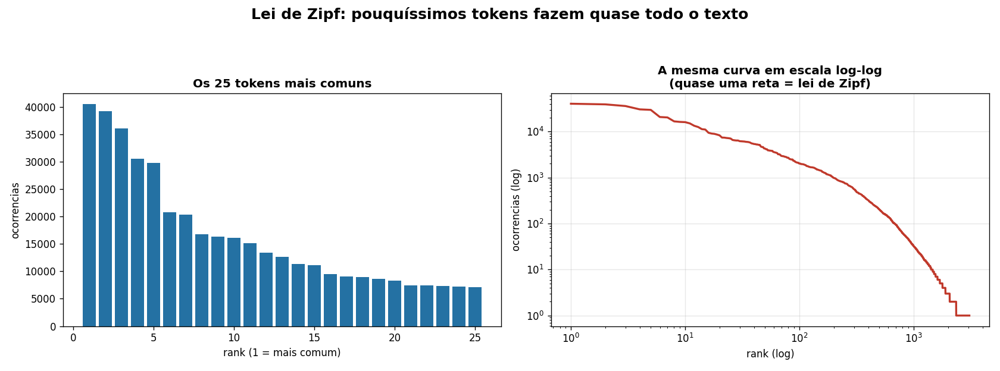
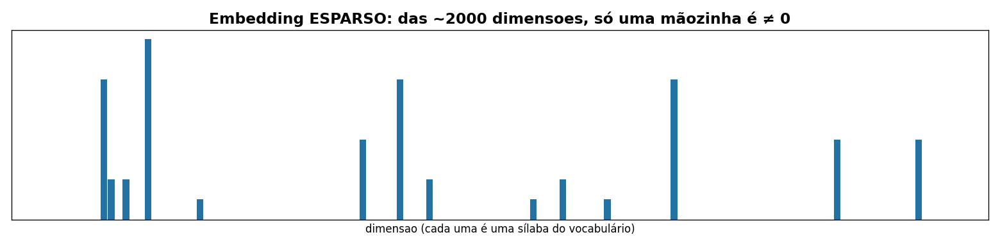
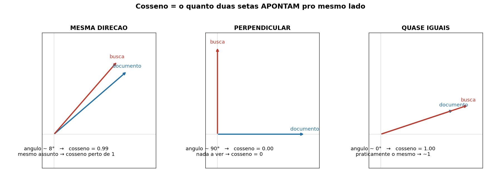
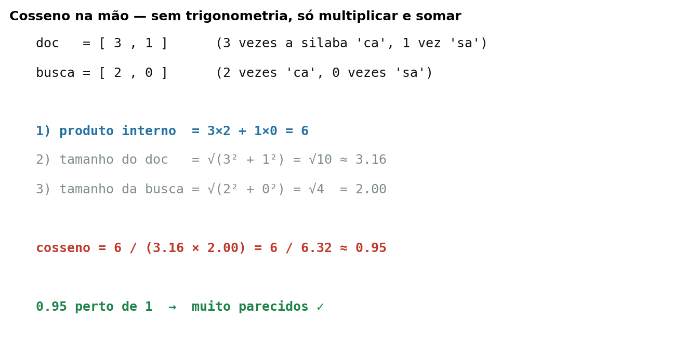
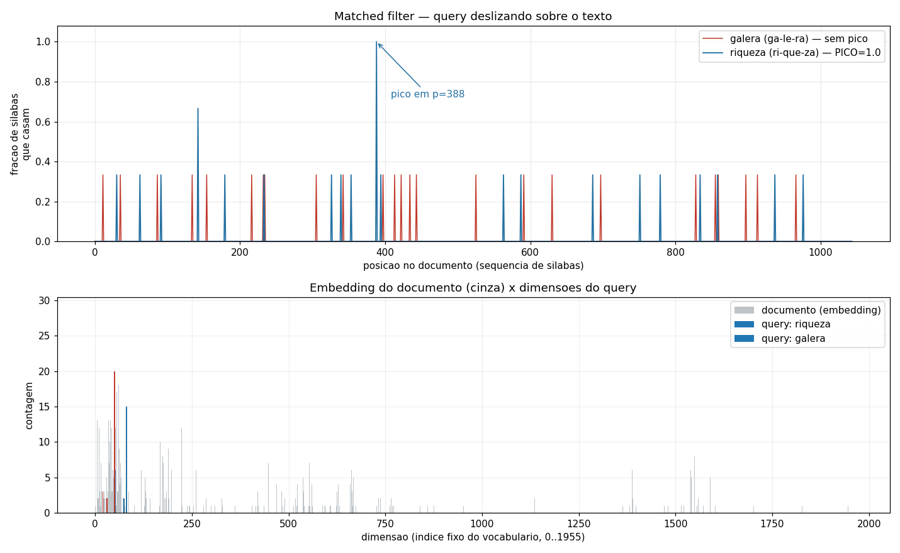

<!-- _paginate: false -->
<!-- _header: '' -->

# Como funciona um **RAG**
## Construindo um, do zero, sem mágica

Busca semântica explicada com **sílabas**, contagem e setinhas.

<br>

*Nenhuma rede neural foi maltratada nesta aula.*

<!-- Apresentador: a meta de hoje NAO é decorar fórmula. É ENTENDER a intuição.
Tudo que mostrarmos roda de verdade na pasta logic_path/. -->

---

## O combinado de hoje

- Vamos partir do **zero**. Se você não lembra de Álgebra Linear, **ótimo** — a gente reconstrói o necessário aqui.
- Cada ideia vem com **uma analogia** e **um exemplo pequeno** antes de qualquer fórmula.
- Tudo que aparecer nos slides **roda no código** (`logic_path/`). No fim, você roda com as próprias mãos.

> Regra da aula: se uma fórmula aparecer sem explicação, **me interrompe**.

---

## O que é RAG? (a ideia em 1 frase)

**RAG = Retrieval-Augmented Generation**
→ "Geração de texto **com consulta** a uma base."

Analogia: **prova com consulta**.
- A IA (o aluno) é boa de escrever, mas **não sabe os seus dados**.
- Antes de responder, ela **busca** os trechos certos no seu material...
- ...e responde **com base neles**.

A parte difícil — e o foco de hoje — é o **buscar os trechos certos**.

<!-- O "G" (geração) é o LLM. Hoje a gente foca 100% no "R" (retrieval): como
achar, num corpus gigante, os pedaços relevantes pra uma pergunta. -->

---

## O mapa da aula (11 passos)

| # | passo | o que você aprende |
|---|---|---|
| 00–01 | vocabulário, tokens, Zipf | **texto → pedacinhos** |
| 03 | histograma | **pedacinhos → números (vetor)** |
| 04 | cosseno | **comparar dois textos** |
| 05–06 | sequência, matched filter | **a ordem importa** |
| 07 | motor distribuído | **escala + ranking** |
| 08–09 | índice, skip list | **busca rápida** |
| 10 | base RAG | **juntar tudo** |

Vamos seguir essa trilha. 🧭

---

## Por que sílabas?

No RAG real, o "pedacinho" (token) vira um vetor com **centenas de números** que ninguém consegue ler.

Aqui o token é a **sílaba** (`ca`, `sa`, `nho`). Vantagem didática:

- Você **vê** o vetor (`casa` = `ca` + `sa`).
- Cabe na cabeça e no quadro.
- A **matemática é exatamente a mesma** do RAG de verdade.

> Trocar "sílaba" por "embedding neural" depois é só trocar a peça. A engrenagem é idêntica.

---

# Parte 1
## Texto vira pedacinhos

---

## Tokenizar = quebrar o texto

Computador não entende "casa". Ele precisa de **unidades**.

```
"casa"      → ca · sa
"trabalho"  → tra · ba · lho
"montanha"  → mon · ta · nha
```

Cada unidade dessas é um **token**. Tokenizar é só isso: **picar o texto** em tokens.

> No ChatGPT o token é "pedaço de palavra". Aqui é a **sílaba**. Mesma ideia.

---

## Vocabulário = a régua fixa

Pra comparar textos, todos têm que usar a **mesma régua**: uma lista de tokens em **ordem que nunca muda**.

```
posição 0 → "ba"
posição 1 → "be"
posição 2 → "bi"
...
posição 5 → "ca"     ← "ca" é SEMPRE a dimensão 5
```

Nosso vocabulário tem **1.956 sílabas** (passo `00`).

> Por que a ordem não pode mudar? Já já você vê: cada posição vira uma "gaveta" do vetor. Se as gavetas trocarem de etiqueta, nada bate.

---

## A Lei de Zipf (um presente da natureza)

Conte os tokens de um livro inteiro. Surge **sempre** o mesmo padrão:



**Pouquíssimos** tokens aparecem muito; uma cauda enorme aparece raramente.
→ Por isso um vocabulário **finito** dá conta de quase todo texto. (passo `01`)

---

# Parte 2
## Pedacinhos viram números

---

## Histograma = contar os tokens

Pegue um texto e **conte** cada token. Isso é o **histograma**:

```
texto: "casa da casa"
  ca → 2     (apareceu em ca-sa, ca-sa)
  sa → 2
  da → 1
```

Esse "mapa de contagens" é a **impressão digital** do texto. (passo `03`)

<!-- bag-of-words / bag-of-syllables: um "saco" de pedacinhos com a contagem. -->

---

## O histograma **é um vetor**

Coloque as contagens nas gavetas do vocabulário, na ordem fixa:

```
vocabulário:  [ ba, be, ..., ca, ..., sa, ..., da, ... ]
texto:        [  0,  0, ...,  2, ...,  2, ...,  1, ... ]
                                ↑         ↑        ↑
```

<span class="big">Isso é um vetor.</span>

Um texto agora é uma **lista de 1.956 números**. E com listas de números a gente sabe fazer conta. 🎉

---

# Parte 3
## Álgebra Linear sem susto

---

## O que é um vetor? (esqueça o trauma)

**Vetor = lista de números.** Só isso.

Você usa vetores todo dia:

```
receita de bolo = [ 3 ovos, 2 farinha, 1 açúcar ]
carrinho mercado = [ 6 cervejas, 1 carvão, 2 carnes ]
```

O **nosso** vetor é a lista de contagens das sílabas. Mesma coisa.

---

## Vetor também é uma **seta**

Uma lista de 2 números é uma seta num gráfico:

```
  [3, 2]  →  ande 3 pra direita, 2 pra cima, e desenhe a flecha
```

- A **direção** da seta = "sobre o que o texto fala".
- O **tamanho** da seta = "quão longo é o texto".

Guarde isso: pra comparar **assunto**, o que importa é a **direção**, não o tamanho.

---

## Nosso vetor é **esparso**

São ~2.000 dimensões, mas um texto curto usa pouquíssimas:



**Esparso** = quase tudo zero. (Bom: dá pra guardar e comparar muito rápido — parte 8.)

---

# Parte 4
## Comparar dois textos = **cosseno**

---

## A pergunta central

> Tenho o vetor do **documento** e o vetor da **busca**.
> Como meço se eles **falam da mesma coisa**?

Primeira ideia: medir a **distância** entre as pontas das setas.

**Problema:** um texto longo tem seta **grande**; um curto, seta **pequena**.
A distância pune o texto longo **mesmo falando do mesmo assunto**. ❌

---

## A ideia boa: o **ângulo**

Não importa o tamanho da seta — importa **pra onde ela aponta**.



- Apontam **junto** → mesmo assunto.
- Apontam **perpendicular** → nada a ver.

---

## Cosseno: o número do ângulo

O **cosseno** transforma o ângulo num número fácil:

| setas | ângulo | cosseno | leitura |
|---|---|---|---|
| mesma direção | 0° | **1.0** | idênticas em assunto |
| meio diferentes | 45° | ~0.7 | parecidas |
| perpendiculares | 90° | **0.0** | nada a ver |

<span class="ok">Regra de bolso: cosseno perto de 1 = parecidos. Perto de 0 = diferentes.</span>

---

## Cosseno na mão (sem trigonometria!)

Você só precisa **multiplicar e somar**:



<!-- Passo 1 (produto interno) = multiplica gaveta a gaveta e soma.
Passo 2 e 3 = tamanho de cada seta (Pitágoras).
Cosseno = produto interno dividido pelos dois tamanhos. -->

---

## Por que dividir pelo tamanho?

Dividir pelos tamanhos das setas é **"encolher as duas pro mesmo comprimento"**.

Assim sobra só a **direção** — exatamente o que a gente queria comparar.

```
cosseno(doc, busca) =  (multiplica gaveta a gaveta e soma)
                       ─────────────────────────────────────
                          (tamanho do doc) × (tamanho busca)
```

É **uma linha de código** (`sylkit/vector.py → cosine`). E é **o coração de todo RAG**.

---

# Parte 5
## Buscar = achar os mais parecidos (recall)

---

## Busca vetorial

Para uma pergunta, calcule o **cosseno com cada documento** e pegue os **maiores**.

```
busca: "riqueza"
  chunk 56  → cosseno 0.44   ← topo!
  chunk 243 → cosseno 0.15
  chunk 12  → cosseno 0.02
```

Isso se chama **recall**: trazer os candidatos mais promissores. (passo `04`)

---

## tf-idf: nem todo token vale igual

A sílaba `de` aparece em **todo** texto → não ajuda a distinguir nada.
A sílaba `nha` (de monta-**nha**) é rara → quando bate, **diz muito**.

**idf** dá peso à **raridade**: token comum vale pouco, token raro vale muito.

> É o mesmo motivo de "e", "de", "a" não servirem pra buscar no Google. Chamam-se *stopwords*.

---

# Parte 6
## A ordem importa

---

## O buraco do "saco de pedacinhos"

O histograma **joga a ordem fora**. Então:

```
"riqueza"  → ri · que · za
"queriza"  → que · ri · za     (palavra inventada)
```

...têm o **mesmo histograma**! O bag não distingue. ❌

Na nossa aula: `galera` tem **cobertura 100%** das sílabas no texto...
mas a **sequência** `ga-le-ra` **não existe** lá. **Falso positivo.** (passo `05`)

---

## Matched filter: deslizar e medir o encaixe

Deslize a busca sobre o texto e meça **quanto casa** em cada posição:



`riqueza` faz um **pico em 1.0** (a cadeia existe). `galera` fica **chato** (nunca fecha). (passo `06`)

---

# Parte 7
## Fazer isso em escala

---

## Chunk: fatiar o documento

Não se indexa um livro inteiro como **um** vetor (vira sopa).
Quebra-se em **chunks** (pedaços de ~2.000 letras).

```
livro  →  [chunk 0][chunk 1][chunk 2] ... [chunk 1488]
```

Cada chunk vira **um vetor**. A busca acha o **chunk** certo, não o livro. (passo `10`)

---

## Sharding: dividir pra conquistar

1.489 chunks, vários "trabalhadores" (shards). Cada um guarda **uma fatia**.

```
        pergunta
           │  (manda pra todos = broadcast)
   ┌───────┼───────┐
 shard0  shard1  shard2     ← cada um acha seus melhores
   └───────┼───────┘
        junta tudo (merge) → resposta
```

É **scatter-gather** — como Google e Elasticsearch funcionam. (passo `07`)

---

## Ranking de 2 estágios (o pulo do gato)

Comparar a pergunta com **tudo** caro demais. Então:

1. **Recall (barato):** cosseno em todos → pega os **20 melhores**.
2. **Rerank (caro):** só nos 20, faz a conta cara (ordem/proximidade) → pega o **top 5**.

> Filtro grosso e rápido **→** filtro fino e preciso.
> **Esse é o desenho de TODO RAG de produção.** Decore este slide. 🎯

---

# Parte 8
## Buscar rápido de verdade

---

## Índice invertido (postings)

Em vez de varrer o texto, guarde, pra cada token, **onde** ele aparece:

```
"ca"  → [3, 17, 42, 91, ...]
"sa"  → [4, 43, 92, ...]
```

Buscar a frase `ca-sa` = achar posições **coladas** (4 logo depois de 3...).
Isso é **intersecção de listas** — sem reler o texto. (passo `08`)

---

## Galloping: pule os buracos

Pra cruzar duas listas (uma rara, uma comum):

- **Ingênuo:** anda de 1 em 1 nas duas. Lento.
- **Galloping:** ancora na lista **rara** (poucas tentativas) e **salta** (1,2,4,8...) na comum.

Na nossa medição: **até 6,9× menos comparações.** (passo `08`)

> Intuição do Pacman estava certa: ancorar no **raro** limita o pior caso.

---

## Skip list: comprimir sem perder velocidade

Listas gigantes são **comprimidas** (guarda só o "pulo" entre posições).
Mas aí o acesso aleatório morre.

**Skip list** = atalhos em **camadas** (como índice de livro: capítulo → seção → página).

Resultado medido: acesso aleatório **~1.000× mais barato**. (passo `09`)

---

# Parte 9
## Juntando tudo: a base RAG

---

## A base (passo 10)

A fase **offline** que prepara tudo pra busca ser instantânea:

```
livro → chunks → vetor de cada chunk → tf-idf → arquivo JSON
```

Esse JSON **é** a base (o "vector store"). 1.489 chunks, ~1 milhão de sílabas, em segundos.

A busca (parte 7) só **consome** esse arquivo. Offline prepara, online responde.

---

## Da nossa aula → pro RAG de verdade

| nossa aula | RAG de produção |
|---|---|
| sílaba (token) | pedaço de palavra (token) |
| histograma de sílabas | **embedding** (rede neural) |
| **cosseno** | **cosseno** (idêntico!) |
| nosso JSON | vector DB (Pinecone, Qdrant, Weaviate) |
| galloping / skip list | índice do vector DB |

<span class="ok">A peça muda; a engrenagem é a mesma que vocês aprenderam hoje.</span>

---

## Recapitulando a trilha

1. Texto → **tokens** (sílabas) e um **vocabulário** fixo
2. Tokens → **histograma** = **vetor**
3. Comparar vetores = **cosseno** (ângulo entre setas)
4. **tf-idf**: dar peso ao raro
5. A **ordem** importa (sequência, matched filter)
6. **Escala**: chunks, sharding, **ranking de 2 estágios**
7. **Velocidade**: índice invertido, galloping, skip list
8. **Base**: tudo persistido num arquivo

---

## Mãos à obra 🛠️

```bash
cd logic_path
python3 00_build_syllabary.py     # o vocabulário
python3 01_tokenizer_zipf.py      # Zipf no livro inteiro
python3 03_histogram.py           # o embedding de um trecho
python3 04_vector_search.py riqueza galera    # cosseno!
python3 05_sequence_search.py riqueza galera  # ordem importa
python3 07_distributed_engine.py "Frodo Bolseiro"
```

Leia o `00_LEIA-ME.md` — cada arquivo tem o conceito explicado no topo.

---

<!-- _paginate: false -->
<!-- _header: '' -->

# Perguntas?

**O segredo todo do RAG cabe numa frase:**

> transforme texto em **setas de números**,
> e ache as que **apontam pro mesmo lado**.

🙏 *Shalom — bom código a todos.*
